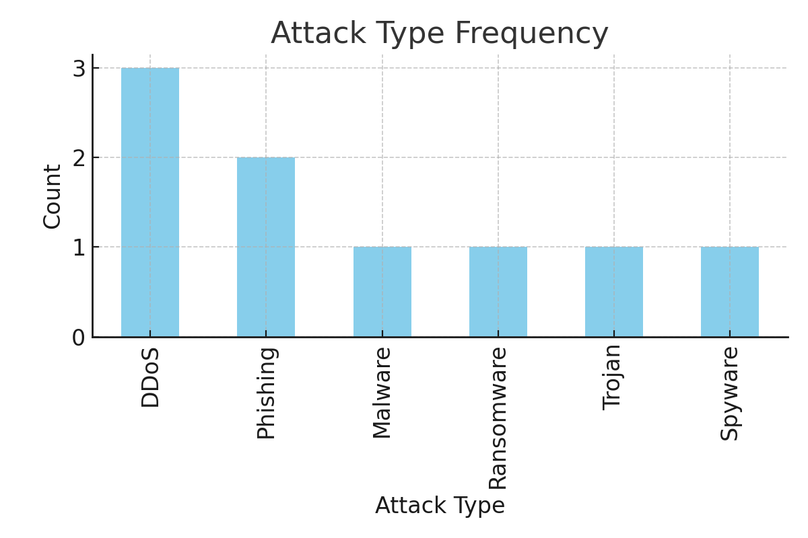
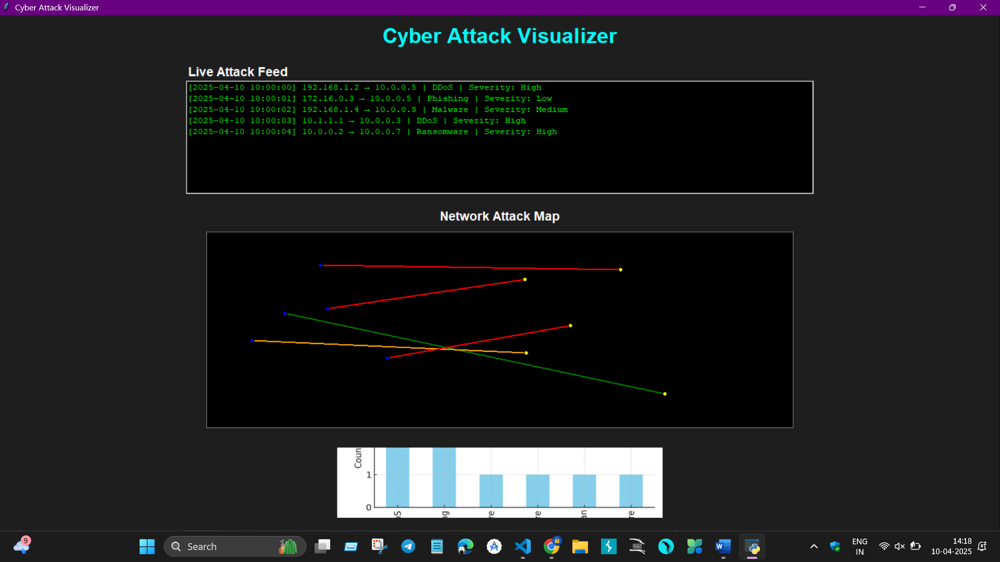
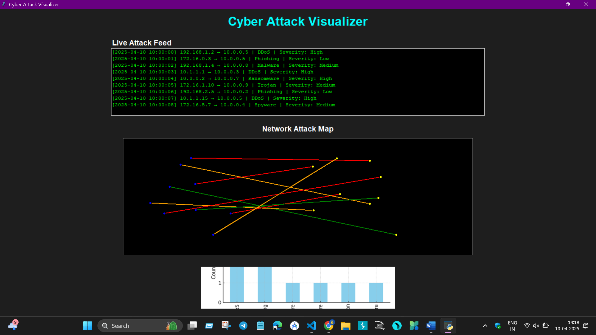

# AttackRadar-Real-Time-Visualization-of-Simulated-Network-Breaches

# 🛡️ Cyber Attack Visualizer

A Python-based GUI application designed to simulate and visualize cyber attacks on a network. This project demonstrates the integration of algorithms, data visualization, and GUI design to create an interactive and informative tool.

---

## 📑 Table of Contents

1. [✨ Features](#features)
2. [🛠️ Technologies Used](#technologies-used)
3. [⚙️ Installation](#installation)
4. [🚀 Usage](#usage)
5. [📂 Project Structure](#project-structure)
6. [📸 Screenshots](#screenshots)
7. [🔮 Future Enhancements](#future-enhancements)
8. [👩‍💻 About the Developers](#about-the-developers)
9. [📜 License](#license)

---

## ✨ Features

- **📡 Live Attack Feed**: Displays real-time attack data, including timestamps, source/destination IPs, attack types, and severity.
- **🗺️ Network Visualization**: Visualizes attack paths dynamically on a network map.
- **🔀 Algorithm Selector**: Choose between BFS and Dijkstra for pathfinding.
- **📤 Export Feed**: Save the attack feed to a CSV file for further analysis.
- **🔔 Sound Alerts**: Beep sound for high-severity attacks (Windows only).
- **📸 Screenshot Capture**: Save the current GUI state as a PNG image.

---

## 🛠️ Technologies Used

### Core Libraries:
- **Tkinter**: For creating the graphical user interface.
- **Pandas**: For handling and processing attack data.
- **Pillow**: For image processing and rendering.
- **Winsound**: For sound alerts (Windows only).

### Algorithms:
- **BFS (Breadth-First Search)**: For unweighted graph traversal.
- **Dijkstra's Algorithm**: For weighted graph traversal.

---

## ⚙️ Installation

Follow these steps to set up the project locally:

1. Clone the repository:
   ```bash
   git clone https://github.com/your-username/attack-radar.git
   ```
2. Navigate to the project directory:
   ```bash
   cd attack-radar
   ```
3. Install the required dependencies:
   ```bash
   pip install -r requirements.txt
   ```
4. Run the application:
   ```bash
   python main.py
   ```

---

## 🚀 Usage

- Launch the application to start the simulation.
- View the **📡 Live Attack Feed** for real-time attack details.
- Observe the **🗺️ Network Visualization** for attack paths.
- Use the **🔀 Algorithm Selector** to switch between BFS and Dijkstra.
- Save the attack feed using the **📤 Export Feed** button.
- Capture the GUI state using the **📸 Save Screenshot** button.

---

## 📂 Project Structure

```
/assets
  ├── attack_chart.png       # Sample attack chart image
  ├── screenshot_example.png # Placeholder for screenshots
/attack_data.csv             # Sample attack data
/main.py                     # Main application file
/requirements.txt            # Python dependencies
```

---

## 📸 Screenshots

> **Note**: Store all screenshots in the `/assets` and `/screenshot` directory.

### 🏠 Chart Interface


### 🏠 Home Page


### 📋 Manage Students Page


---

## 🔮 Future Enhancements

- **🌐 Cross-Platform Sound Alerts**: Replace `winsound` with a cross-platform library like `playsound`.
- **📊 Advanced Visualization**: Add support for 3D network visualization.
- **🔒 Authentication**: Implement user authentication for secure access.
- **📈 Analytics Dashboard**: Add a dashboard for attack trend analysis.
- **🧪 Testing**: Add unit tests for algorithms and GUI components.

---

## 👩‍💻 About the Developers

This project was developed by **Ayush Thakur**, a passionate software developer with expertise in Python and data visualization.

- [Ayush Thakur](https://github.com/aayushthakur001/)

---

## 📜 License

This project is licensed under the [MIT License](LICENSE).
